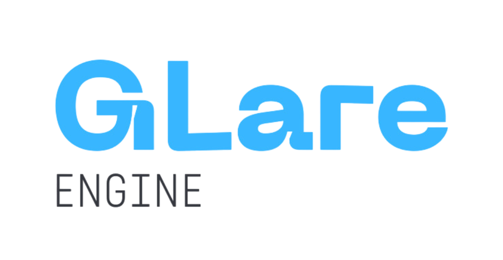
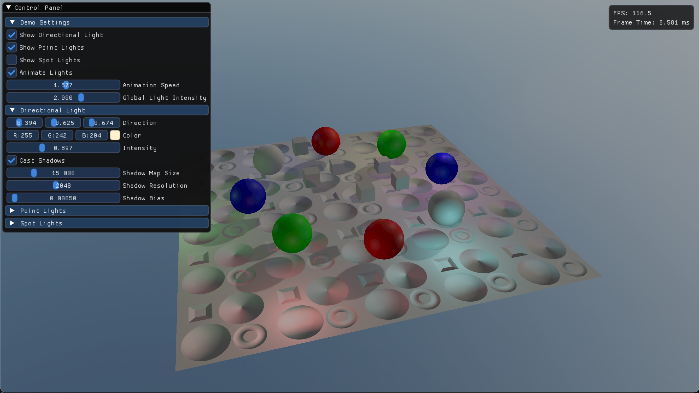
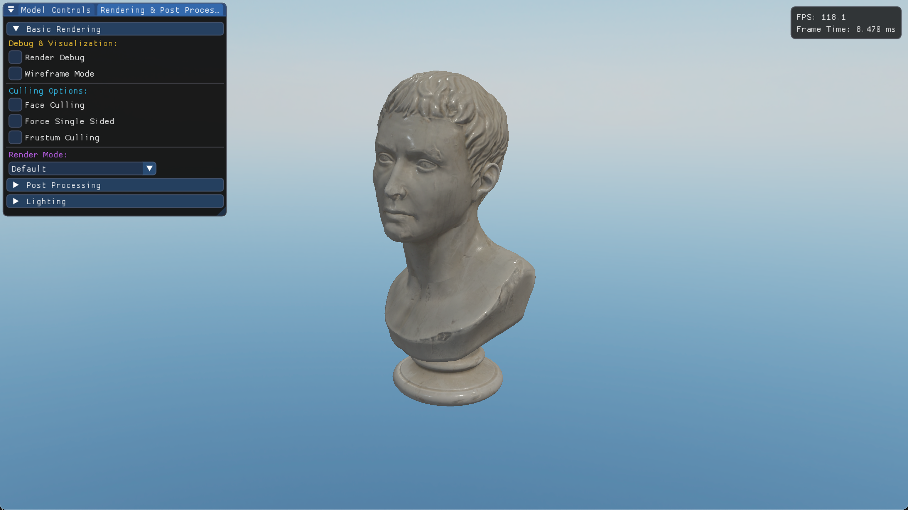
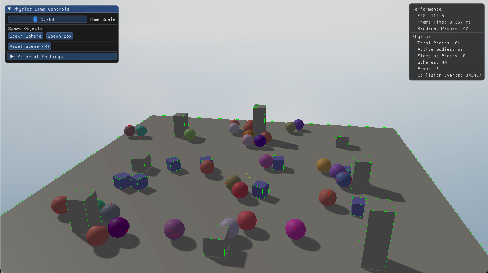
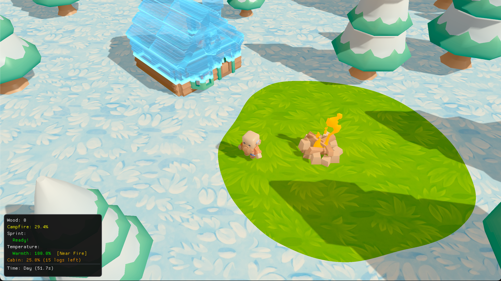

<div align="center">
  
  
  <p>
    A lightweight, single header OpenGL engine designed for simple games, and hobbyist projects.  
GLare is built around an Entity Component System (ECS), making it simple to define and manipulate scenes while hiding the OpenGL boilerplate.
  </p>
  
  [](https://opensource.org/licenses/MIT)
  []()
  []()
  
  
  <p><em>Survival game built with GLare Engine</em></p>
</div>

---

## Features
- **Single header design** — the entire engine is contained within `GLare.hpp`
- **Cross platform** — supports macOS and Windows
- **Entity Component System (ECS)** — simple API for working with `Scenes`, `Entities`, and `Components`
- **Model loading** — supports animated and skinned glTF / GLB files with materials and textures
- **Lighting** — supports directional, point, and spot lights
- **Physics integration** — built with ReactPhysics3D with support for physics bodies
- **Materials & Shaders** — supports defining custom shaders or use built in defaults
- **Physically Based Rendering (PBR)** — supports albedo/base color, normal, metallic/metalness, roughness, and emissive maps

---

## Installation

1. Clone GLare into your project's libraries directory

2. In your CMakeLists.txt:
```cmake
set(CMAKE_CXX_STANDARD 20)
project(YourProject)

# Include directories
include_directories(
    ${PROJECT_SOURCE_DIR}/src
    ${PROJECT_SOURCE_DIR}/libs/GLare-Engine/include
)

# Add GLare subdirectory
add_subdirectory(libs/GLare-Engine)

# Create your executable
add_executable(${PROJECT_NAME} src/main.cpp)

# Link GLare to your target
target_link_libraries(${PROJECT_NAME} PRIVATE glare)
```

Then in your source code:
```cpp
#include "GLare.hpp"
```

All dependencies are included under `third-party/core` and will be automatically linked.  
For most use cases, no additional setup is required.

---

## Usage

This is a minimal example of setting up a scene with a camera, a directional light, and a sphere, using glfw for the window:

```cpp
#include "GLare.hpp"
#include <GLFW/glfw3.h>

int main() {
    glfwInit();
    glfwWindowHint(GLFW_CONTEXT_VERSION_MAJOR, 4);
    glfwWindowHint(GLFW_CONTEXT_VERSION_MINOR, 1);
    glfwWindowHint(GLFW_OPENGL_PROFILE, GLFW_OPENGL_CORE_PROFILE);
    glfwWindowHint(GLFW_OPENGL_FORWARD_COMPAT, GLFW_TRUE);
    
    GLFWwindow* window = glfwCreateWindow(800, 600, "Hello World", nullptr, nullptr);
    glfwMakeContextCurrent(window);    
    gladLoadGLLoader((GLADloadproc)glfwGetProcAddress);
    
    int width, height;
    glfwGetFramebufferSize(window, &width, &height);
    
    auto scene = std::make_shared<GLR::Scene>();
    auto renderer = std::make_shared<GLR::Renderer>(width, height);
    
    auto camera = scene->createEntity("Camera");
    camera->addComponent<GLR::Transform>(glm::vec3(0.0f, 0.0f, 5.0f), glm::vec3(0.0f), glm::vec3(1.0f));
    camera->addComponent<GLR::CameraComponent>(width, height, 45.0f, 0.1f, 100.0f);
    scene->setMainCamera(camera);
    
    auto light = scene->createEntity("Sun");
    light->addComponent<GLR::Transform>(glm::vec3(0.0f, 0.0f, 0.0f), glm::vec3(-1.0f, -1.0f, 0.0f), glm::vec3(1.0f));
    light->addComponent<GLR::DirectionalLight>(glm::vec3(-1.0f, -1.0f, 0.0f), glm::vec3(1.0f, 1.0f, 1.0f), 1.0f, true, 30.0f);
    
    auto sphereMesh = std::make_shared<GLR::Mesh>();
    sphereMesh->create(GLR::Shape::generateSphere(1.0f, 32), GLR::Shape::getSphereIndices(32), GLR::Shape::getStandardLayout());
    
    auto material = std::make_shared<GLR::Material>(renderer->getObjectShader());
    material->setVector4("baseColorFactor", glm::vec4(0.8f, 0.2f, 0.2f, 1.0f));
    
    auto sphere = scene->createEntity("Sphere");
    sphere->addComponent<GLR::Transform>(glm::vec3(0.0f, 0.0f, 0.0f), glm::vec3(0.0f), glm::vec3(1.0f));
    sphere->addComponent<GLR::MeshRenderer>(sphereMesh, material);

    GLR::TimeStep ts;
    float lastFrame = glfwGetTime();
    
    while (!glfwWindowShouldClose(window)) {
        float currentFrame = glfwGetTime();
        ts.updateTimeStep(lastFrame, currentFrame);
        lastFrame = currentFrame;
        
        if (glfwGetKey(window, GLFW_KEY_ESCAPE) == GLFW_PRESS) {
            glfwSetWindowShouldClose(window, true);
        }
        
        scene->update(ts.getDeltaTime());
        renderer->render(*scene, GLR::Color::Black());
        glfwSwapBuffers(window);
        glfwPollEvents();
    }
    
    scene->clearEntities();
    glfwDestroyWindow(window);
    glfwTerminate();
    return 0;
}
```
For more comprehensive engine usage examples, see the `examples/` directory.

---

## Examples

GLare includes several example applications that showcase different engine features. To build and run them:

```bash
git clone https://github.com/Maxwell-SS/GLare-Engine.git
cd GLare-Engine
mkdir build && cd build
cmake .. -DGLARE_BUILD_EXAMPLES=ON
cmake --build .
```

Executables will be located in the `build/examples/` directory.

### 1. Lighting Demo
Demonstrates directional, point, and spot lights with basic meshes.



**Controls**  
- `W/S`: Zoom in/out  
- `Arrow Keys`: Rotate camera

### 2. Model Loading Demo
Loads and displays glTF / GLB models with materials and textures.



**Controls**  
- `Mouse`: Look around  

### 3. Physics Demo
Introduces rigid bodies, gravity, and collisions using ReactPhysics3D.



**Controls**  
- `W/S`: Zoom in/out  
- `Arrow Keys`: Rotate camera

### 4. Demo Game
A small interactive game combining model loading, lighting, and physics into something playable.



**Controls**  
- `W/A/S/D`: Move character
- `Shift`: Sprint
- `E`: Chop trees
- `F`: Interact

---

## Limitations

GLare is purely programmatic and has no editor or visual tools to work with. There are only simple rendering optimizations, frustum and backface culling, the renderer doesn’t do batching or any advanced tricks. Since the engine uses OpenGL 4.1, it misses out on most of the newer graphics techniques.


---

## License
Distributed under the MIT License. See `LICENSE` for more information.